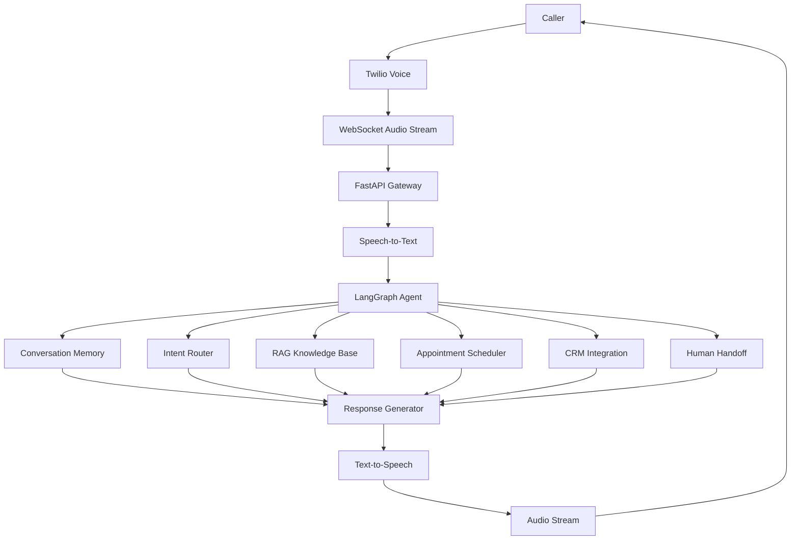
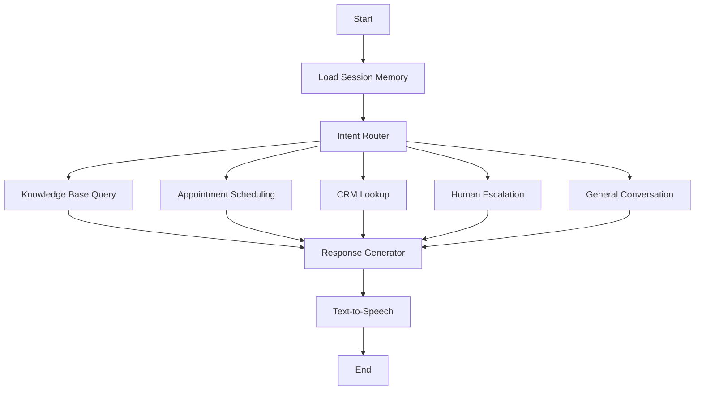

# VoicePilot-AI

An enterprise-grade AI Voice Receptionist capable of handling real-time phone conversations using a streaming Speech-to-Text → LLM → Text-to-Speech pipeline.

The system is designed to answer customer queries, schedule appointments, transfer calls to human agents, retrieve information from company knowledge bases, and maintain contextual conversations with low latency.

This project is being built as a production-oriented AI Engineering project focused on real-time communication, agent orchestration, retrieval-augmented generation (RAG), and telephony integration.

---

## Current Status

🚧 Project Under Active Development (CODE IN MASTER BRANCH)

This repository will be updated incrementally as new components are implemented.

Current phase:

* Architecture Design
* Infrastructure Planning
* Core Agent Flow Design

Upcoming phases:

* Voice Streaming Pipeline
* Telephony Integration
* RAG Knowledge Base
* Appointment Scheduling
* Human Handoff System
* Production Deployment

---

## Tech Stack

### Backend

* Python
* FastAPI
* WebSockets
* LangGraph

### AI Layer

* OpenAI / Gemini
* RAG Pipeline
* Session Memory
* Multi-Agent Workflows

### Data Layer

* PostgreSQL
* Redis
* ChromaDB / Vector Store

### Telephony

* Twilio Voice
* Real-Time Audio Streaming

### Infrastructure

* VPS / Cloud Deployment
* Docker
* Nginx

---

## Planned Features

### AI Receptionist

* Natural phone conversations
* Multi-turn dialogue support
* Context-aware responses
* Session memory

### Real-Time Voice Processing

* Streaming Speech-to-Text
* Streaming LLM responses
* Streaming Text-to-Speech
* Low latency audio generation

### Barge-In Detection

Allow callers to interrupt the AI while it is speaking.

The system immediately:

* Detects incoming user speech
* Stops current TTS playback
* Cancels ongoing response generation
* Switches control back to the caller

This creates a more natural human-like conversation experience.

---

### Knowledge Base (RAG)

* Company FAQs
* Product documentation
* Policies and procedures
* Dynamic document ingestion

---

### Appointment Scheduling

* Calendar integration
* Slot availability checks
* Booking confirmation
* Rescheduling support

---

### Human Handoff

Escalate calls to a human agent when:

* User requests human assistance
* AI confidence is low
* Business rules require escalation

---

### CRM Integration

* Customer lookup
* Interaction history
* Call summaries
* Lead creation

---

### Call Analytics

* Conversation transcripts
* Response latency metrics
* Call duration analytics
* Agent performance insights

---

## High Level Architecture

---

## Planned LangGraph Workflow

---

## Performance Goals

* Sub 3 second response latency
* Real-time audio streaming
* Interruptible conversations
* Production-ready architecture
* Horizontally scalable design

---

## Roadmap

### Phase 1

* Project setup
* FastAPI foundation
* WebSocket communication
* LangGraph integration

### Phase 2

* Twilio voice integration
* Streaming STT
* Streaming TTS

### Phase 3

* Session memory
* RAG knowledge base
* Tool calling

### Phase 4

* Appointment scheduling
* CRM integration
* Human handoff

### Phase 5

* Redis optimization
* Monitoring
* Production deployment

---

## Future Enhancements

* Multi-language support
* Voice cloning
* Sentiment analysis
* Voice biometrics
* Multi-agent orchestration
* Autonomous outbound calling

---

This README will evolve continuously as the project progresses and new capabilities are implemented.
