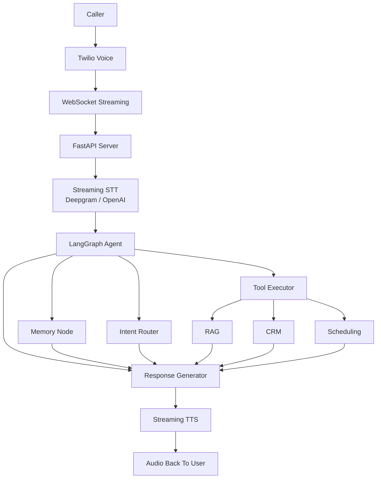

# Initial Architecture Diagram

```mermaid
flowchart TD

    A[Caller]
    B[Twilio Voice]
    C[WebSocket Streaming]
    D[FastAPI Server]

    E[Streaming STT<br/>Deepgram / OpenAI]

    F[LangGraph Agent]

    G[Memory Node]
    H[Intent Router]
    I[Tool Executor]
    J[Response Generator]

    K[RAG]
    L[CRM]
    M[Scheduling]

    N[Streaming TTS]
    O[Audio Back To User]

    A --> B
    B --> C
    C --> D
    D --> E
    E --> F

    F --> G
    F --> H
    F --> I
    F --> J

    I --> K
    I --> L
    I --> M

    G --> J
    H --> J
    K --> J
    L --> J
    M --> J

    J --> N
    N --> O
```
